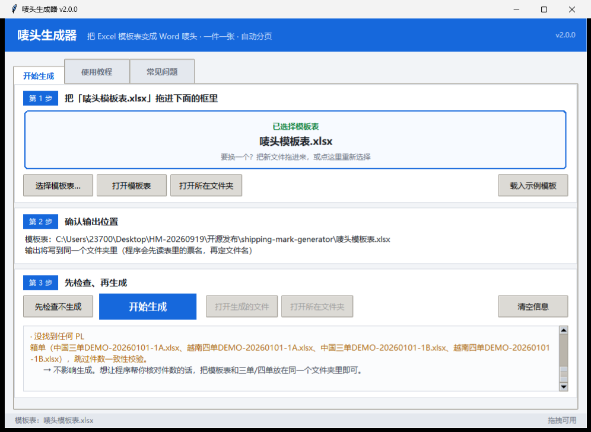
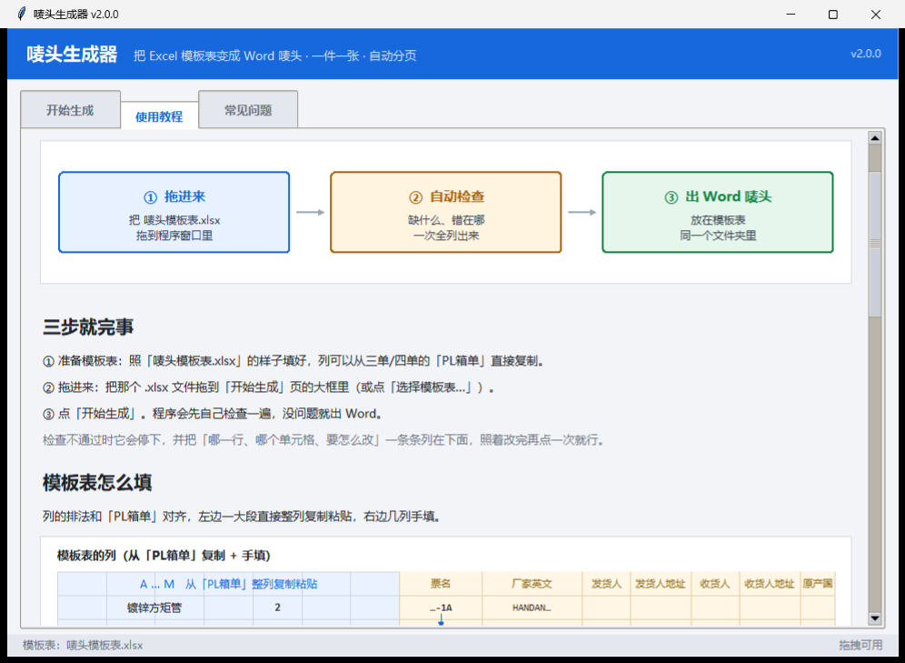
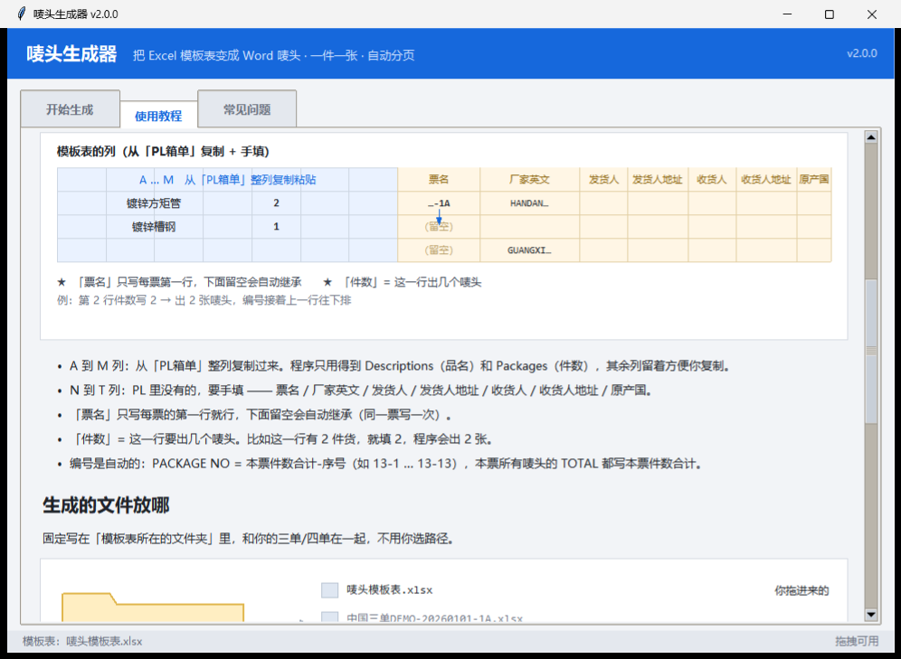
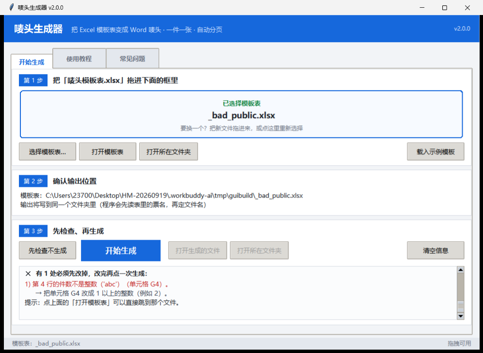

# 唛头生成器 · Shipping Mark Generator

> 把 Excel 里的装箱信息，一键变成**一页一张、自动分页**的 Word 唛头（Shipping Marks）。
> Turn an Excel packing list into print-ready Word shipping marks — one mark per package,
> one page each, with automatic page breaks.

[](https://www.python.org/)
[]()
[]()
[](LICENSE)

**中文** ｜ [English](#english)

---

## 这是干什么的

外贸/报关场景里，一批货要贴几十上百张唛头（Shipping Mark）。手工复制粘贴 Word 又慢又容易错号。

这个工具让你：

1. 把装柜/装箱信息填进一张 Excel（**列和 PL 箱单对齐，整列复制粘贴就行**）
2. 把表拖进窗口
3. 得到一份 Word —— 一件货一个唛头、一页放一张、块与块之间自动分页

**输出固定写在模板表所在的文件夹里**，不用选路径。

### 界面



程序里自带 **使用教程** 和 **常见问题** 两个页签，图示是矢量画的（缩放不糊）：



模板表的列怎么排、票名写在哪、件数什么意思 —— 教程里有图：



出错了不会只甩一句「失败」，而是告诉你**第几行、哪个单元格、改成什么**：



---

## 安装 / 运行

只依赖 `openpyxl`（GUI 另外用标准库 `tkinter`，拖拽可选 `tkinterdnd2`）：

```bash
pip install openpyxl
# 想要拖拽功能再装这个；不装也行，界面里用「选择模板表…」按钮
pip install tkinterdnd2
```

```bash
python make_mark_gui.py                    # 图形界面（拖表进来 → 生成）
python make_mark.py                        # 命令行，用同目录 mark_config.json
python make_mark.py -i 模板表.xlsx -o 输出.docx
python make_mark.py --dry-run              # 只检查不写文件
python make_mark.py --self-test            # 跑「测试用例」里的全部用例
```

### 打成 exe 给不装 Python 的同事

```bash
pip install pyinstaller
pyinstaller --onedir --windowed --name "唛头生成器" \
  --add-data "<绝对路径>/唛头母本.docx;." \
  --add-data "<绝对路径>/mark_config.json;." \
  --add-data "<绝对路径>/唛头模板表.xlsx;." \
  --exclude-module numpy --exclude-module PIL --exclude-module pandas \
  --exclude-module scipy --exclude-module matplotlib --exclude-module IPython \
  make_mark_gui.py
```

> ⚠ **一定要用 `--onedir`，不要 `--onefile`。**
> 实测：onefile 每次启动都要把 1000 个文件解到 `%TEMP%` 再让杀软逐个扫，
> 启动要 **97 秒**；`--onedir` 只要 **1.1 秒**。
> ⚠ `--add-data` 的源路径是**相对 `--specpath`**，不是 cwd —— 必须给绝对路径。

打包后的一个 exe 同时是 GUI 和命令行：无参数开窗口，带 `-i/-o/--dry-run` 就是命令行模式。

---

## 模板表怎么填

| 列 | 内容 |
|---|---|
| `A..M` | 与 **PL 箱单**同名同序，**整列复制粘贴**即可：Items / Descriptions / Specifications / Material / Quantity / Unit / **Packages** / NW / Net weight (kg) / GW / Gross weight (kg) / CBM / 品名中英文。程序只用得到 `Descriptions` 和 `Packages`，其余列留着方便你复制。 |
| `N..T` | PL 里没有的，要手填：**票名** / 厂家英文 / 发货人 / 发货人地址 / 收货人 / 收货人地址 / 原产国 |

- 第 1 行 = 表头（**可用别名**，列顺序可换）
- 第 2 行起 = 明细行（整行空则跳过）
- **票名只写每票第一行**，下面留空会自动继承
- **件数** = 这一行要出几个唛头（这行有 2 件货就写 2）
- 编号自动生成：`PACKAGE NO = 本票件数合计-序号`（如 `13-1 … 13-13`），
  本票所有唛头的 `TOTAL` 都写本票件数合计

---

## 它会帮你检查什么

| 级别 | 情况 | 行为 |
|---|---|---|
| ✕ 必须改 | 必填项为空 / 件数不是 ≥1 的整数 / 单元格是公式但没有缓存值 / 表头一列都不认识 | **停下**，一次列全，每条带「行号 + 单元格 + 怎么改」 |
| ! 问你 | 件数合计与同目录 PL 箱单的 Packages 对不上 / 唛头内容太长一页放不下 | **弹窗**，讲清后果，你决定要不要继续 |
| · 只提示 | 表头有多余的列 / 票名行不连续 / 找不到 PL 文件 | 提示一下，**照常生成** |

### 内容太长、一页放不下会怎样

一个唛头固定 11 行、18pt 字，默认母本下大约能放 **24 行**（折行之后算）。
程序没有 Word 的排版引擎，只能按字体宽度**估**。估超了它会告诉你：

```
票「TEST-OVER-1」的唛头 2-1（源第 2 行）预估 27.0 行 > 单页容量 24.0 行，会溢出到第二页
→ 最长的是「CNEE'S ADDRESS」这一段（多占 3.0 行）—— 把它缩短约 233 个字符
  （英文按字母算），或者删掉地址里的多余空格/换行，这个唛头就能收回一页。
```

**后果**：那个唛头会被拆到两页；因为它后面跟着硬分页符，**后面的唛头会整体错位、页码也跟着变**。
你可以按提示精简，也可以不管它继续生成。
想让程序「超了就干脆不让生成」：把 `mark_config.json` 里 `overflow_check.on_overflow` 改成 `"error"`。

---

## 配置（`mark_config.json`）

| 键 | 说明 |
|---|---|
| `master_docx` | 版式母本。字体 / 字号 / 页边距都取自它 |
| `uppercase_fields` | 自动转大写的列（默认：品名英文、厂家英文） |
| `fill_down_fields` | 留空可继承上一行的列（默认含票名） |
| `required_fields` | 必填项。删掉某项就不再强制 |
| `total_singular` | 件数=1 时写 `1 PACKAGE` 还是 `1 PACKAGES` |
| `overflow_check` | `on_overflow`: `warn`（默认，只提示）\| `error`（停下） |
| `pl_check` | 件数与三单/四单 PL 箱单的核对开关；`dir` 可给多个目录 |

**改版式**：用 Word 打开 `唛头母本.docx`，改字体/字号/页边距，保存即可 ——
生成器会自动读新的页面几何（包括溢出容量）。别改文件名。

---

## 测试

三套，改完代码都要跑：

```bash
python make_mark.py --self-test            # 13 个用例（10 正 + 3 负），产出 docx 逐块断言
cd 测试用例 && python run_tests.py          # 同上但更详细，逐块打印
cd 测试用例 && python gui_tests.py          # GUI 专用：13 个 --check 断言 + 1 个端到端 --build
```

覆盖：一票多物 / 多票一物 / 票名不连续 / 字符兼容（`& < > " — 全角 emoji 零宽空格 控制字符`）/
特殊格式（文本·浮点·全角件数、合并单元格、富文本）/ 单页溢出 / 多余列 / 最小单张 /
必填缺失 / 件数非法 / 缺列 / 公式无缓存。

文件名以 `负面` 开头的用例 = **期望失败**。

---

## 目录

```
make_mark.py           核心逻辑：解析 Excel → 校验 → 克隆母本 → 写 docx（含命令行）
make_mark_gui.py       图形界面（tkinter），同时是 GUI 与命令行的统一入口
make_gui_cases.py      从模板表派生出边界用例（开发用）
mk_release.py          组装发行目录并打 zip（开发用）
mark_config.json       配置
唛头母本.docx           版式母本（字体/字号/页边距的来源）
唛头模板表.xlsx         示例输入表（带「使用说明」sheet）
测试用例/               全部用例 + 两个 runner
```

---

## 设计取舍（为什么这么做）

- **不用浏览器做界面**：浏览器只能把文件下载到 Downloads，做不到「写回模板表所在文件夹」。
- **GUI 与 CLI 共用同一套校验**：核心函数的 `sink` 钩子让两边不会分叉 ——
  不传 `sink` 就是原来的「打印 + 退出」，传了就只收集结构化问题。
- **宽容但不含糊**：能忽略的（多余列、空行、票名不连续）绝不报错；
  必须停下的，一定说清改哪里。
- **不自动缩排 / 不自动缩字号**：那会改变版式，而唛头必须和母本一致。
- **`tkinter` 软导入**：`--check` / `--build` 是纯命令行路径，没装 tkinter 的机器也能跑。

---

## License

MIT © 2026

---

<a name="english"></a>
# English

**Shipping Mark Generator** — turn an Excel packing list into print-ready Word shipping marks:
one mark per package, one page each, automatic page breaks.

Built for the export/customs workflow where a shipment needs dozens of marks that must be
pasted onto cartons. Hand-copying them in Word is slow and error-prone.

### Features

- **Drag & drop** an `.xlsx` into the window (falls back to a file picker if drag-drop is unavailable)
- **Output always lands next to the template** — no path picking
- **Built-in tutorial and FAQ tabs**, with vector-drawn diagrams (crisp at any size)
- **Actionable errors**: every problem names the *row*, the *cell*, and *what to type instead*
- **Three severity levels** — hard errors, "are you sure?" prompts, and silent warnings
- **Overflow detection**: estimates whether a mark will spill onto a second page, names the
  longest paragraph, and tells you roughly how many characters to cut
- **One exe serves both GUI and CLI** (no args → window; `-i/-o/...` → CLI)
- Zero third-party deps beyond `openpyxl` (`tkinter` is stdlib; `tkinterdnd2` optional)

### Quick start

```bash
pip install openpyxl
python make_mark_gui.py            # GUI
python make_mark.py --dry-run      # CLI, check only
```

### Template layout

| Columns | Content |
|---|---|
| `A..M` | Same names/order as your packing list — **copy the columns straight over**. Only `Descriptions` (commodity) and `Packages` (how many marks for this row) are used. |
| `N..T` | Ticket / manufacturer / shipper / shipper address / consignee / consignee address / origin |

Header aliases are supported and column order is flexible. Write the ticket name on the first
row of each ticket only — blank cells inherit from the row above.

### Packaging

Use **`--onedir`**, never `--onefile`: onefile re-extracts ~1000 files to `%TEMP%` on every
launch and antivirus scans each one — measured **97 s** startup vs **1.1 s** for onedir.

### Tests

```bash
python make_mark.py --self-test
cd 测试用例 && python run_tests.py && python gui_tests.py
```

### License

MIT
